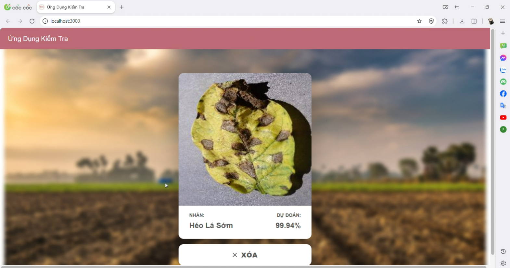
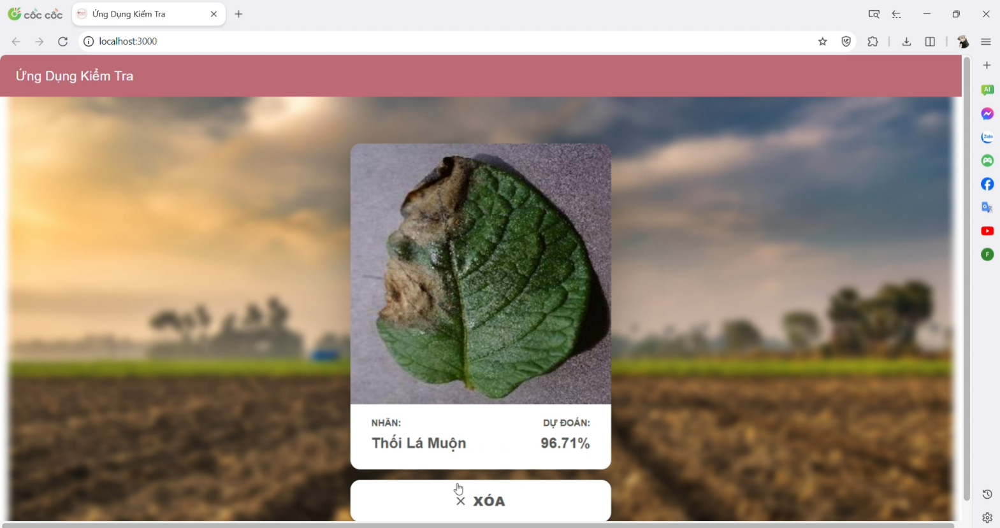
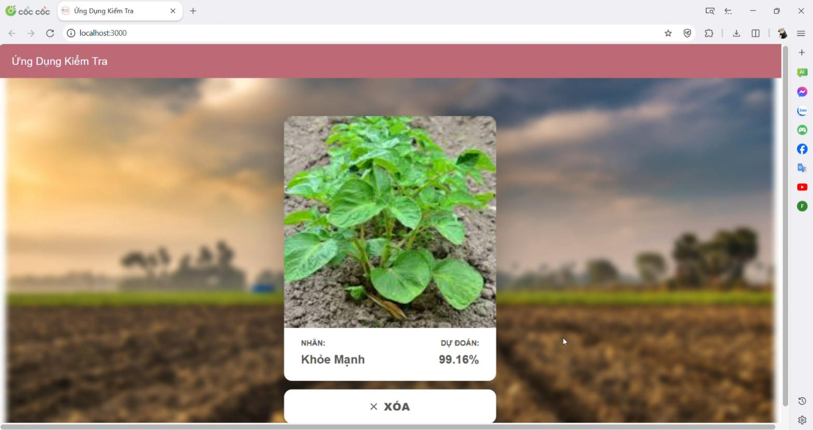
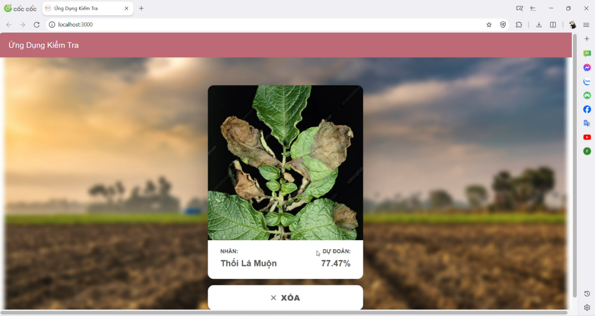
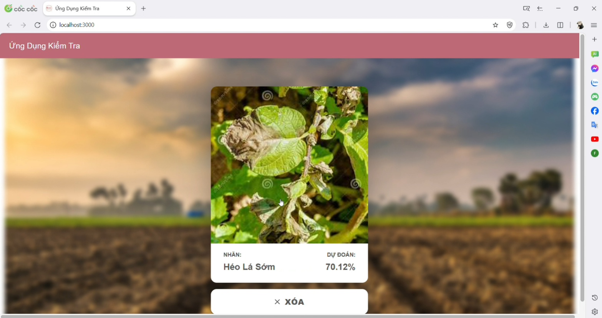

1. Prediction of potato leaf disease based on leaf photographs
2. using convolutional neural networks model
3. predictive interface design using reactjs
4. The program will predict 3 labels: Early_blight, Late_blight, Healthy
## Demo program
demo 1

demo 2

demo 3

demo 4

demo 5

